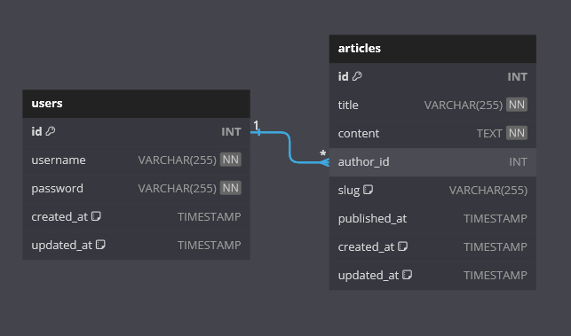

# ▪️ Deskripsi

Restful API Portal dibangun menggunakan Golang(Gin Web Framework) dan RDBMS MySQL. pada Restful API Portal terdiri dari beberapa service diantaranya:

- **Service Registrasi User** : registrasi user baru
- **Service Login User** : login user untuk mendapatkan access token dan refesh token
- **Service Refresh Token User** : membuat access token baru, jika access token telah kadaluarsa
- **Service Get User** : untuk mendapatkan user yang sedang login
- **Service Change Password User** : untuk mengganti password user
- **Service Get All Articles** : untuk mendapatkan semua artikel
- **Service Get All Articles By Author** : untuk mendapatkan semua artikel author tertentu
- **Service Get Article** : untuk mendapatkan detail artikel
- **Service Add Article** : untuk membuat artikel baru
- **Service Update Article** : untuk mengupdate artikel
- **Service Delete Article** : untuk menghapus artikel

berikut
**<a href="https://api.postman.com/collections/25522873-7d1315cd-aba1-4331-99d6-833ae9887738?access_key=PMAT-01HGZBBZGPFX13C7ZZ9ADFN3QX">Postman Collection Resftful Portal</a>**

<!-- dan
**<a href="https://github.com/meingga/restful-portal/docs/api-contract.json">open API Restful Portal</a>** -->

# ▪️ ERD (Entity Relationship Diagram)



- TOOLS: https://dbdiagram.io/d

  - SCRIPT ERD

    ```
    Table "users" {
        "id" INT [pk, increment]
        "username" VARCHAR(255) [unique, not null]
        "password" VARCHAR(255) [not null]
        "created_at" TIMESTAMP [default: `CURRENT_TIMESTAMP`]
        "updated_at" TIMESTAMP [default: `CURRENT_TIMESTAMP`]
    }

    Table "articles" {
        "id" INT [pk, increment]
        "title" VARCHAR(255) [not null]
        "content" TEXT [not null]
        "author_id" INT
        "slug" VARCHAR(255) [default: NULL]
        "published_at" TIMESTAMP
        "created_at" TIMESTAMP [default: `CURRENT_TIMESTAMP`]
        "updated_at" TIMESTAMP [default: `CURRENT_TIMESTAMP`]
    }

    Ref:"users"."id" < "articles"."author_id"
    ```

- IMPLEMENTASI ERD (MEMBUAT DATABASE)

  Pada Restful API ini saya menggunakan RDBMS MySQL

  1. Buat Database dengan nama restful_portal

  ```
    CREATE DATABASE restful_portal;
    use restful_portal;
  ```

  2. Buat Table users, dan articles pada database restful_portal

  ```
   CREATE TABLE users (
       id INT PRIMARY KEY AUTO_INCREMENT,
       username VARCHAR(255) UNIQUE NOT NULL,
       password VARCHAR(255) NOT NULL,
       created_at TIMESTAMP DEFAULT CURRENT_TIMESTAMP,
       updated_at TIMESTAMP DEFAULT CURRENT_TIMESTAMP ON UPDATE CURRENT_TIMESTAMP
   );

   CREATE TABLE articles (
       id INT PRIMARY KEY AUTO_INCREMENT,
       title VARCHAR(255) NOT NULL,
       content TEXT NOT NULL,
       author_id INT,
       slug VARCHAR(255) DEFAULT NULL,
       published_at TIMESTAMP,
       created_at TIMESTAMP DEFAULT CURRENT_TIMESTAMP,
       updated_at TIMESTAMP DEFAULT CURRENT_TIMESTAMP ON UPDATE CURRENT_TIMESTAMP,
       FOREIGN KEY (author_id) REFERENCES users(id)
  );
  ```

  berikut bisa di download: **<a href="https://github.com/meingga/restful-portal/docs/restful-portal.sql">restful-portal.sql</a>**

# ▪️ Instalasi

Berikut adalah langkah-langkah untuk menjalankan Restful API.

## Prasyarat

Pastikan sistem Anda memenuhi prasyarat berikut sebelum menggunakan aplikasi:

- ✔️ GO 1.21.1 (_disarankan_) / Docker Images golang:1.21.1-alpine
- ✔️ MySQL
- ✔️ Git
- ✔️ Code Editor (goland/vscode/sublime text/dll)

## Langkah-langkah Instalasi

1.  Clone repositori dari GitHub:

```bash
git clone https://github.com/meingga/restful-portal
```

2.  Configurasi _.env_

    - rename .env.example => .env

    - Ganti **_host_**, **_port_**, **_username_**, **_password_**, dan **_database name_** anda

    - untuk **_secret key_** bebas di isi key random, access dan refresh tidak boleh sama key randomnya.

      ```
      DB_HOST=
      DB_PORT=
      DB_USER=
      DB_PASSWORD=
      DB_NAME=

      SECRET_KEY_ACCESS=
      SECRET_KEY_REFRESH=
      ```

      contoh:

      ```
      DB_HOST=localhost
      DB_PORT=3306
      DB_USER=root
      DB_PASSWORD=
      DB_NAME=restful_portal

      SECRET_KEY_ACCESS=4cC335S_K3y
      SECRET_KEY_REFRESH=R3fR35H_K3y
      ```

3.  Jalankan Restful API Portal

    Buka terminal dan arahkan ke direktori restful_portal.

    - jika kita **tidak menggunakan Docker**

      ```
      <!-- windows os -->
      $ go run src\main.go

      <!-- linux/unix/mac os -->
      $ go run src/main.go
      ```

    - jika kita **menggunakan Docker**

      - Membuat image Docker:

      ```
      $ docker build -t restful_portal .
      ```

      - Jalankan container dari image yang baru dibuat:

      ```
      $ docker run -p 8383:8383 restful_portal
      ```

      Restful Portal sekarang akan berjalan di dalam wadah Docker dan dapat diakses melalui localhost:8383 pada laptop anda.

# ▪️ STRUKTUR APLIKASI

```

│   ...
│   .env.example                // example environment
│   Dockerfile                  // Dockerfile
│   README.md                   // Documentation Restful Portal
│
├───docs                        // folder documentation open api restful portal
│       api-contract.json       // openAPI api-contract restful portal
│       erd.png                 // erd image
│
└───src                         // folder source
    │   main.go                 // file main
    │
    ├───helpers                 // folder helpers
    │   │   helpers.go          // file helpers
    │   │
    │   ├───jwt                 // folder jwt helpers
    │   │       jwt.go          // file jwt helpers
    │   │
    │   └───mysql               // folder db mysql helpers
    │           mysql.go        // file db mysql helpers
    │
    ├───middleware              // dolder middleware authentication token
    │       middleware.go       // file middleware authentication token
    │
    └───modules                 // folder modules
        ├───articles            // folder module package articles
        │       articles.go
        │       entity.go
        │       formatter.go
        │       input.go
        │       repository.go
        │       service.go
        │
        └───users               // folder module package users
                entity.go
                formatter.go
                input.go
                repository.go
                service.go
                users.go

```

# ▪️ PENJELASAN MIDDLEWARE UNTUK OTENTIKASI PENGGUNA

Middleware untuk otentikasi pengguna menggunakan JWT token bertujuan untuk memverifikasi keaslian pengguna sebelum membiarkan mereka mengakses endpoint tertentu atau sumber daya yang dilindungi. Dalam konteks ini, middleware akan memeriksa token JWT yang disertakan dalam setiap permintaan dan memastikan bahwa token tersebut valid.

Berikut adalah penjelasan singkat tentang bagaimana middleware otentikasi pengguna dengan JWT token dapat diimplementasikan:

1.  Token JWT:

    - Pengguna akan menerima access token JWT dan refresh token JWT setelah berhasil login.
    - Access token sendiri digunakan untuk mengakses service-service yang terdapat pada restful portal dan saat ini di set expirednya 30 menit.
    - Refresh token sendiri digunakan untuk mengakses service refresh token untuk mengenarate access token baru jika access token expired. saat ini refresh token di set expirednya 24 jam atau 1 hari.
    - Token ini dapat disertakan dalam header Authorization setiap kali pengguna melakukan permintaan ke endpoint yang memerlukan otentikasi.
    - berikut sample code generate access token dan refresh token saat login

    ```

    ...
    var (
        TIMEOUT_ACCESS  = time.Minute * 30
        TIMEOUT_REFRESH = time.Hour * 24
    )

    func (s *jwtService) GenerateToken(userID int) (string, string, error) {
        claim := jwt.MapClaims{}
        claim["user_id"] = userID
        claim["exp"] = time.Now().Add(TIMEOUT_ACCESS).Unix()

        token := jwt.NewWithClaims(jwt.SigningMethodHS256, claim)

        signedToken, err := token.SignedString([]byte(os.Getenv("SECRET_KEY_ACCESS")))
        if err != nil {
            return signedToken, "", err
        }

        claim["exp"] = time.Now().Add(TIMEOUT_REFRESH).Unix()
        token = jwt.NewWithClaims(jwt.SigningMethodHS256, claim)

        refreshToken, err := token.SignedString([]byte(os.Getenv("SECRET_KEY_REFRESH")))
        if err != nil {
            return signedToken, refreshToken, err
        }
        return signedToken, refreshToken, nil
    }
    ...

    ```

2.  Middleware Otentikasi:

        - Middleware otentikasi akan memeriksa keberadaan token dalam header Authorization.
        - Jika token tidak ada atau tidak valid, middleware akan menolak akses dan mengembalikan respons status tidak terotorisasi (401 Unauthorized).
        - berikut sample code middleware otentikasi saat akses ke service

        pada main.go kita tambahkan parameter para router **_middleware.AuthMiddleware(authService, usersService)_**

        ```
            ...
            authService := helperJWT.NewService()

            usersRepository := users.NewRepository(db)
            usersService := users.NewService(usersRepository)
            usersHandler := users.NewUserHandler(usersService, authService)

            articlesRepository := articles.NewRepository(db)
            articlesService := articles.NewService(articlesRepository)
            articlesHandler := articles.NewHandler(articlesService)

            router := gin.Default()

            router.Use(cors.Default())
            api := router.Group("api/v1")

            api.POST("/users", usersHandler.Register)
            api.POST("/login", usersHandler.Login)
            api.GET("/refresh-token", usersHandler.RefreshToken)
            api.GET("/users/fetch", middleware.AuthMiddleware(authService, usersService), usersHandler.FetchUser)
            api.PUT("/users/:id", middleware.AuthMiddleware(authService, usersService), usersHandler.Update)

            api.GET("/articles", middleware.AuthMiddleware(authService, usersService), articlesHandler.GetArticles)
            api.GET("/articles/:id", middleware.AuthMiddleware(authService, usersService), articlesHandler.GetArticle)
            api.POST("/articles", middleware.AuthMiddleware(authService, usersService), articlesHandler.CreateArticle)
            api.PUT("/articles/:id", middleware.AuthMiddleware(authService, usersService), articlesHandler.UpdateArticle)
            api.DELETE("/articles/:id", middleware.AuthMiddleware(authService, usersService), articlesHandler.DeleteArticle)
            ...
        ```

3.  Verifikasi Token:

    - Middleware akan melakukan verifikasi token JWT untuk memastikan keasliannya.
    - Verifikasi melibatkan pemeriksaan tandatangan (signature) token, validitas waktu kadaluarsa (expired), dan validitas claim-claim tertentu (misalnya, ID pengguna, peran, dll) tapi untuk case disini hanya pengecekan expired.

    pada middleware mengambil header authorization dan split untuk mendapatkan token jwtnya lalu kita validasi tokennya dan expirednya

        ```
        ...
            func AuthMiddleware(authService helperJWT.Service, userService users.Service) gin.HandlerFunc {
                return func(c *gin.Context) {
                    authHeader := c.GetHeader("Authorization")

                    if !strings.Contains(authHeader, "Bearer") {
                        response := helpers.APIResponse("Unauthorized", http.StatusUnauthorized, "error", nil)

                        c.AbortWithStatusJSON(http.StatusUnauthorized, response)
                        return
                    }

                    tokenString := ""

                    arrayToken := strings.Split(authHeader, " ")
                    if len(arrayToken) == 2 {
                        tokenString = arrayToken[1]
                    }

                    token, err := authService.ValidateAccessToken(tokenString)

                    if err != nil {
                        response := helpers.APIResponse("Unauthorized", http.StatusUnauthorized, "error", nil)

                        c.AbortWithStatusJSON(http.StatusUnauthorized, response)
                        return
                    }

                    claim, ok := token.Claims.(jwt.MapClaims)

                    if !ok || !token.Valid {
                        response := helpers.APIResponse("Unauthorized", http.StatusUnauthorized, "error", nil)

                        c.AbortWithStatusJSON(http.StatusUnauthorized, response)
                        return
                    }

                    userID := int(claim["user_id"].(float64))

                    user, err := userService.GetUserByID(userID)

                    if err != nil {
                        response := helpers.APIResponse("Unauthorized", http.StatusUnauthorized, "error", nil)

                        c.AbortWithStatusJSON(http.StatusUnauthorized, response)
                        return
                    }

                    c.Set("currentUser", user)
                }
        }
        ...
        ```

4.  Set Pengguna yang Diotentikasi:

    - Jika token berhasil diverifikasi, middleware dapat menetapkan informasi pengguna yang diotentikasi ke dalam konteks permintaan, sehingga dapat diakses oleh handler endpoint selanjutnya.
    - Informasi ini dapat berupa ID pengguna, peran, atau data lain yang relevan.

      berikut source code untu set pengguna pada middleware

          ```
            ...
            userID := int(claim["user_id"].(float64))

            user, err := userService.GetUserByID(userID)

            if err != nil {
                response := helpers.APIResponse("Unauthorized", http.StatusUnauthorized, "error", nil)

                c.AbortWithStatusJSON(http.StatusUnauthorized, response)
                return
            }

            c.Set("currentUser", user)
            ...
          ```

Jadi implementasi middleware otentikasi pengguna dengan menggunakan Gin(framework web untuk Go)seperti diatas.

untuk refresh token validasinya berada di handler refresh token di users tidak kami jadikan middleware.

# ▪️ KONTAK

Jika ada yang ingin ditanyakan/didiskusikan bisa menghubungi:

```
email: fahmifaqih1257@gmail.com
linkedin: https://www.linkedin.com/in/fahmifaqihem
```
